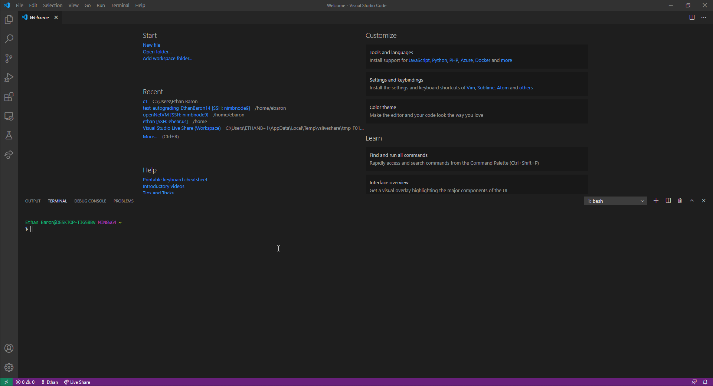
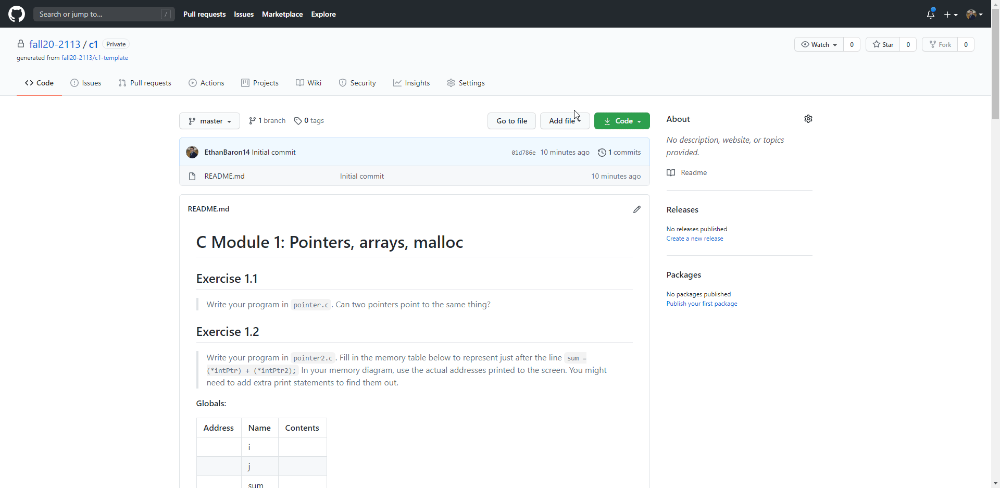
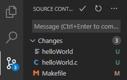
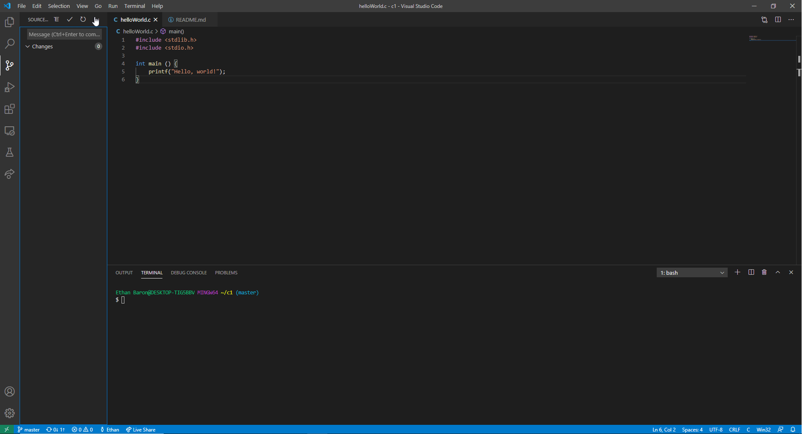

Git is an extremely powerful distributed version control system designed to handle everything from small to very large projects with speed and efficiency. It comes packaged as a command-line tool available for Windows, MacOS and Linux. Git is the industry standard for version controlled development. The goal of this tutorial is to establish a baseline knowledge for cloning, editing, committing and pushing to a GitHub repository in Visual Studio Code. 

### Getting Started ###
- Read through and follow the Visual Studio Code Tutorial shared by your professor
- Have a basic understanding of [GitHub](https://lab.github.com/githubtraining/introduction-to-github) and [Version Control](https://git-scm.com/book/en/v2/Getting-Started-About-Version-Control)
- Verify that [Git](https://git-scm.com/downloads) is installed on your machine with `git --version`
    - Depending on your installation, you may have the Git tools in a standalone application called “Git Bash” or integrated directly into your command line
        - Git Bash comes with Git tools installed
        - If you don’t have Git Bash installed, ensure that you have Git by executing the above command in the command line. 
    - Git comes standard with most Linux releases. Ensure that you have Git installed by executing the above command in the command line.
- Find a GitHub repository you want to edit in Visual Studio Code

### Cloning ###
Git enables users to clone GitHub repositories to make changes on any device that uses the command line. To take advantage of Visual Studio Code’s built-in terminal, we can have Git tools fully integrated into our programming environment.

- First, show the Terminal on Visual Studio Code
    - Click “View -> Terminal” at the top of the screen or press Ctrl + ` or Cmd + `
- If you are on a machine that has Git tools installed through Git Bash, ensure that Git Bash is your default Shell
    - Click the `1: bash` drop-down and choose “Select Default Shell”
    - Select Git Bash as the default Shell

- Clone the repository via `git clone`
    - Find the URL of the repository on GitHub
        - Click the green “Code” button on the repository page
        - Copy the link that appears under “Clone with HTTPS”

- Clone the repository with Git: `git clone <repository URL>`
    - Paste the URL you copied in the terminal and press Enter
- Open the repository folder in Visual Studio Code
    - The newly cloned repository should appear in a folder off your working directory
        - Ensure that this is true by using `ls` and observing that a new folder was created with the same name as your repository
        - Determine what your working directory is via `pwd`
    - In the “Explorer” tab on the left-hand side of Visual Studio Code, click the blue “Open Folder” button and navigate to the directory that was printed
- The Visual Studio Code window should reload and the bottom bar should change color from purple to blue. You should also see the repository files appear in the “Explorer” tab on the left-hand side of Visual Studio Code

### Pushing Changes to GitHub ###
After editing files in your repository, you need to stage, commit and push your changes for them to appear on GitHub. Visual Studio Code makes this process extremely simple and straightforward between built-in Shell integration and GUI Version Control. In this section, we’ll explore two methods for managing a GitHub repository: through Shell and through the GUI.

- **Note**: You should keep in mind that it’s good practice both in classes and industry to keep commits as small as possible. This not only enables educators/reviewers to trace your thought process, but it also allows you to keep multiple “snapshots” of your code that you can revert to if something breaks unexpectedly.

#### Preparation ####
Before you start authoring commits, you’ll want to make sure that any commits you make get attached to your GitHub account so you receive credit for them. GitHub intelligently matches commits to accounts based on usernames and email addresses. 

- If you’re the only one using the machine you intend to push from, you can run these commands:
    - `git config` `--``global user.name <GitHub Username>`
    - `git config` `--``global user.email <GitHub Email Address>`
- If you’re not the only one using the machine, use multiple GitHub accounts, or just want this to be configured for the single repository you’re in, simply remove the `--global` flag from the command and the configuration will be localized to the current repository

#### Version Control with Git ####
Since Visual Studio Code has built-in Shell integration, you can run any Git commands you might need in your repository directory. To learn more about any of the commands discussed, check out the official [Git Reference](https://git-scm.com/docs)

- First, show the Terminal on Visual Studio Code
    - Click “View -> Terminal” at the top of the screen or press Ctrl + ` or Cmd + `
- Navigate to the repository root directory with `cd <directory>`
- View any files that were changed locally with `git status`
    - When you run this command, you might notice there’s a few categories. Let’s explore the output.
        - `Changes not staged for commit` are changes made to files that already exist in your repository. You can either stage these files for committing with `git add <file>` or discard your changes with `git restore <file>`
        - `Untracked files` are files that were created after the most recent commit that you have on your machine. You can stage these files for committing with `git add <file>`
        - `Changes to be committed` are changes that will be bundled into a commit when you run `git commit`. You can unstage your changes with `git restore` `--``staged <file>`
    - We see that `git status` is an extremely powerful command because it allows us to dissect exactly what we changed, both intentionally and by accident, since our last commit
- Stage your changes for committing with `git add <file>`
    - You can specify multiple file names with spaces between each file
    - You can also specify a relative path. 
        - For example, if my file called `NewFile.c` is in `NewFolder`, I can add it from the repository’s root directory with `git add NewFolder/NewFile.c`
    - Alternatively, you can add all files in a folder with `git add NewFolder/`. 
    - Also, add all the files you changed with `git add -A`
- Here, we see that `git add` is another powerful command that supports intuitive shortcuts and flags
- Once you are satisfied that the changes you made are ready for commit and that they show up in the `Changes to be committed` section of the output from `git status`, you can commit them with `git commit`. 
    - This command also has a number of flags that do different things.
        - You can add a commit message inline with the `-m` flag: `git commit -m` `"``Message``"`
        - You can commit all your changes with the `-a` flag, essentially bypassing the `git status` and `git add` steps. This is not advisable for larger projects, but might be useful on small exercises.
    - If you execute `git commit` without the message flag, the default text editor will open and allow you to enter a commit message. Simply save your changes and exit the editor to finalize the commit
- Finally, ensure that the commits you authored appear on GitHub. Note that unless you push your changes, none of your commits will be online, essentially rendering this process pointless. To push your changes, simply use `git push`. If you are working on a different branch than the default, include the remote and branch names with `git push <remote> <branch>`
    - Example: `git push origin master`
    - You might be prompted for your GitHub credentials. Once you enter them correctly, you should see your changes visible on your repository on GitHub

#### Version Control with Visual Studio Code GUI ####
In addition to Shell integration, Visual Studio Code automatically tracks the changes you make to files when you’re in a GitHub repository folder. Note that the feature set of this GUI is limited in that it doesn’t support many of the advanced options that Git supports, but it essentially executes the respective Git commands for the operations you might want to perform “internally”, meaning it writes out and executes the command for you. The advantage of this is that you can visualize the operations you are performing and seamlessly pick up where you left off with Git in the command-line at any time if it gets too complicated. This section walks you through staging, committing and pushing changes to your repository with the Visual Studio Code GUI.

- **Note**: VS Code will leverage your machine’s (or the machine you are working on) Git installation, so you need to install Git first before you get these features. Make sure you install at least version `2.0.0`. For more information, see the “Getting Started” section above
- You can quickly see which files you changed since the most recent commit by selecting the “Source Control” tab on the left-hand side of the Visual Studio Code window. The window should look similar to the below screenshot

- You’ll notice that the tab that appears is more or less a direct visualization of the output of running `git status` in the command line. We’ll talk about the different sections here when they’re relevant
    - “Changes” reflects the `Untracked Files` and `Changes not staged for commit` sections of `git status`
        - This refers to changes you have made to files that were newly created since the last commit, or changes made to files that already exist
        - Notice that there are several different color-coded letters to represent the types of changes you made to the files
            - A green “U” refers to files that are Untracked
            - A yellow “M” refers to files that were Modified
            - A red “D” refers to files that were Deleted
- Notice that you can click on the name of a file on the “Source Control” tab to open a file that shows the difference between the version of the file in the most recent commit and the changes you made. This allows you to easily keep track of the changes you made so you can have a better understanding of the code you changed as well as better commit messages that describe what you did
- Once you are confident that the file(s) you changed are ready to be staged for commit, you can hover over the file name and click the plus icon that appears. This moves the file over to the “Staged Changes” section
    - “Staged Changes” reflects the `Changes to be committed` section of `git status`
        - This refers to changes you have already staged for committing
        - Notice that there are a few different color-coded letters to represent the types of changes you made to the files
            - A green “A” refers to files where an index was added. Essentially, this just means that you created a new file with the contents shown
            - A yellow “M” refers to files whose indices were modified. This means that you edited a file whose index already exists in the repository
            - A red “D” refers to files whose indices were deleted. This case should be self explanatory
    - If you realize that you’re not ready to include changes made to specific files in your commit, you can always click the minus button that appears when you hover over the name of the file. If you realize the changes you made don’t work or broke something and just want to go back, you can discard your changes to a specific file by clicking the curved arrow icon that appears when you hover over the name of the file. Notice that this is irreversible, so you should make sure that you actually want to discard your changes first
- When you have files in the “Staged Changes” section, you can bundle the changes together into a commit. Make sure you enter a good commit message in the “Message” box just above the names of the files and either click the check mark at the top of the tab or press Ctrl + Enter or Cmd + Enter
- Once your commit is created, the files previously in the “Staged Changes” area should disappear. However, we still need to ensure that the commits you authored appear on GitHub. Note that unless you push your changes, none of your commits will be online, essentially rendering this process pointless. To push your changes, simply click the three dots in the top-right hand corner of the “Source Control” tab and click “Push”. If you are working on a different branch than the default, you can change the remote and branch names with “Push to…” in the same menu
    - You might be prompted for your GitHub credentials. Once you enter them correctly, you should see your changes visible on your repository on GitHub

- Also notice that if you are looking for more advanced features that might not be immediately visible in the “Source Control” tab, you can click the three dots and look for the feature there. If it’s not there, consider using Git via the command line