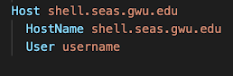

Visual Studio Code (VS Code) is a free code editor available for Windows, MacOS, and Linux. VS Code offers many helpful extensions, including live share features and remote development capabilities. 

Video demo of LiveShare and Connecting to a Server in VS Code: [video]

### Getting Started ###
- Download [VS Code](https://code.visualstudio.com/download) and follow the basic installation instructions
- To familiarize yourself with the user interface, you can also follow this [tutorial](https://code.visualstudio.com/docs/introvideos/basics)

### Live Share Collaboration ### 
- Visual Studio Live Share allows developers to collaboratively edit in real-time through collaboration sessions. This is great for getting help in office hours or working on group projects! 
- First, install the Live Share extension:   
    - Launch VS Code
    - Click on the ‘Extensions’ icon on the left sidebar (or press ```Shift+Command+X```)
    - Search 'Live Share Extension Pack' and install
    - Re-launch VS Code after installation is complete
- **Note**: Linux users may need to follow [extra installation steps](https://docs.microsoft.com/en-us/visualstudio/liveshare/use/vscode) to install Live Share 
- In order to join or host collaboration sessions, you must sign into Visual Studio Live Share with a Microsoft or GitHub account
    - To sign in, click on the blue 'Live Share' status bar item on the bottom of the window or press ```Ctrl + Shift + P or Cmd + Shift + P``` and select 'Live Share: Sign in with Browser' and proceed to sign in
- To learn about more features that Live Share provides, see the [user guide](https://docs.microsoft.com/en-us/visualstudio/liveshare/use/vscode) 
- To edit and share your code with other collaborators in real-time, you can start or join a collaboration session
- To start a session, launch VSCode and click the 'Live Share' status bar on the bottom of the window or press ```Ctrl + Shift + P or Cmd + Shift + P``` and select 'Live Share: Start a collaboration session (Share)'
    - A unique invitation link will automatically be copied to your clipboard which can be shared with others who wish to join your session
    - To access the invitation link again, click on the session state status bar icon and select 'Invite Others (Copy Link)'
- Once you start your session, a pop-up message will notify you that your link has been copied to your clipboard and will allow you to select 'Make read-only' if you wish to prevent guests from editing your files
- If 'read-only' mode is not enabled, hosts and guests both have access to co-edit all files within the development environment as well as view each others edits in real-time
- You will be notified as guests join your session via your invitation link which will also grant you the option to remove them from the session
- To terminate your session, open the 'Live Share' custom tab and select 'Stop collaboration session'
    - After the session has ended, guests will no longer have access to any content 
- Another great thing about Live Share is that it allows you to invite people to view/edit your code without them having to be connected to the same remote environment. So, if you are SSHed into Shell and share a Live Share session with your group members, they can view and edit the same code without also having to connect to Shell. Follow the setup instructions for remote development to learn more!


### Remote Development ###
- VS Code offers the ability to access and edit code remotely while connected to a server through SSH.
    - Note: Students in CSCI 2113 (Software Engineering) will not be required to connect to `shell.seas.gwu.edu` for assignments, but students in CSCI 2461 (Computer Architecture) will be required to connect to `shell.seas.gwu.edu` for assignments.
- First, Download the Remote Development Extension Pack which includes the 'Remote-SSH', 'Remote-WSL', and 'Remote-Containers' extensions:
    - Launch VS Code
    - Click on the 'Extensions' icon on the left sidebar (or press ```Shift + Command + X```)
    - Search 'Remote Development' and install the 'Visual Studio Remote Development Extension Pack'
    - Relaunch VS Code after installation is complete
- Navigate to your system’s .ssh directory 
    - In terminal, ```cd /Users/[username]/.ssh``` 
- Modify the config file to include the following: 
    - (For Mac, Linux, and Windows)



- Launch VS Code and click on the green icon on the lower left corner 
- Select 'Remote-SSH: Connect to Host' and enter your ssh command (```ssh username@shell.seas.gwu.edu```)
- VS Code will automatically connect and set itself up
    - See [Troubleshooting tips](https://code.visualstudio.com/docs/remote/troubleshooting#_troubleshooting-hanging-or-failing-connections) for connection issues and [Fixing SSH file permissions](https://code.visualstudio.com/docs/remote/troubleshooting#_fixing-ssh-file-permission-errors) for permissions errors
    - **For Windows**: make sure you don’t try to do this within a WSL remote session. You may be asked to select the platform of the remote host - choose Linux
- After the connection is complete, you will be in an empty window and can then navigate to any folder or workspace using File -> Open or File -> WorkSpace
- To disconnect from a remote host, select File -> Close Remote Connection or exit VS Code
- **Note**: Local extensions that you installed in your VS Code application are not automatically installed in your remote development environments. So when you connect to a new server on VS Code, you will have to re-install any extensions that you may want to use. For example, if you want to host a Live Share collaboration session while SSHed into Shell, you will have to re-install the Live Share extension by following the same installation instructions while connected to Shell in VS Code 
- **Note**: Just like connecting over SSH in terminal, if you are off campus, you need to be connected to the [GW VPN](https://seascf.seas.gwu.edu/vpn-access) in order to connect to Shell and work remotely 
